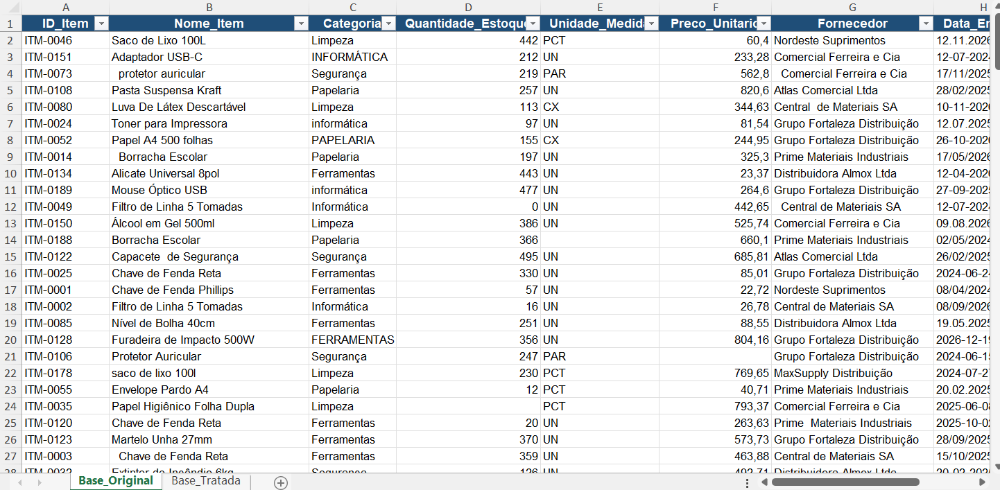
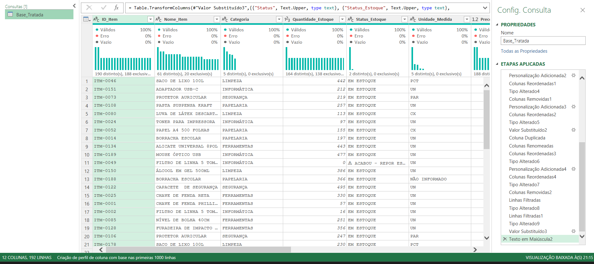
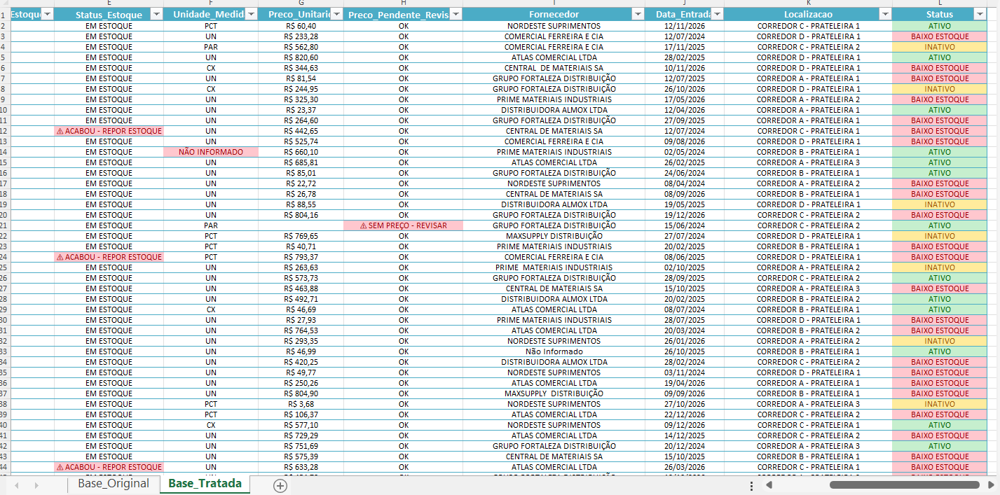

# 🔍 Projeto: Tratamento de Dados (ETL) com Power Query — Base de Estoque

> Um dos meus primeiros exercícios práticos de ETL (Extração, Transformação e Carga) utilizando o **Power Query** do Excel. Este repositório faz parte da minha jornada de transição de carreira para a área de Dados e CRM, servindo como registro e evolução do meu aprendizado técnico.

---

## 📌 Contexto do Projeto
Este projeto simula um cenário fictício de estoque e logística de um almoxarifado. A base de dados bruta foi construída propositalmente contendo problemas comuns de qualidade de dados encontrados no dia a dia corporativo:
* Linhas duplicadas exatas.
* Inconsistências de textos (mistura de maiúsculas e minúsculas).
* Espaços em branco desnecessários (*trailing/leading spaces*).
* Células vazias (valores nulos) em campos críticos.
* Formatos de data divergentes misturados na mesma coluna.

O objetivo foi aplicar um fluxo completo de **ETL** para limpar, padronizar e preparar os dados, deixando a base pronta para integração futura com sistemas de CRM (como o Salesforce).

---

## 🔍 Visão Geral da Base Bruta
A base original continha as "sujeiras" propositais que desafiaram o processo de limpeza:

> 

---

## 🛠️ Metodologia e Processo no Power Query
O tratamento foi executado inteiramente no **Power Query**, seguindo etapas estruturadas:

1. **Remoção de Duplicatas Exatas:** Criei uma consulta auxiliar de conferência (*Conferencia_Duplicatas*) por agrupamento e contagem de linhas para garantir que apenas duplicatas reais fossem removidas (de 200 para 192 linhas).
2. **Padronização de Texto e Espaços:** Conversão para letras maiúsculas e aplicação da função *Trim* para remover espaços extras.
3. **Tratamento Inteligente de Nulos:** Valores numéricos zerados ou textos categóricos ausentes receberam substituições lógicas (*0* ou *"Não Informado"*). **Boas Práticas:** Preços e datas ausentes **não** foram chutados para não distorcer relatórios; mantive-os nulos e criei colunas auxiliares de alerta para revisão humana.
4. **Padronização de Datas:** Unificação de quatro formatos de texto diferentes (pontos, traços e barras) para o tipo nativo de *Data*.

> 

---

## ✨ Resultado Final: Base Tratada
Após o tratamento, a base passou de 10 para 12 colunas (com a adição de colunas auxiliares de controle) e 0% de erros ou inconsistências de formatação.

> 

---

## 🚀 Próximos Passos na Jornada
* Importação da base tratada para um ambiente de playground no **Salesforce**.
* Criação de fluxos de automação (*Flows*) para impedir a entrada de dados fora do padrão diretamente na origem.
* Evolução para projetos mais complexos envolvendo modelagem relacional, SQL e Power BI.

---
✍️ *Desenvolvido por **Thais Cristine** — Em constante evolução na análise e engenharia de dados.*
